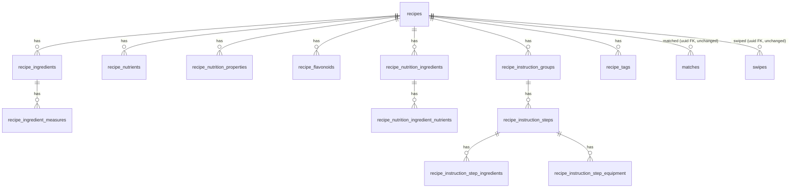

# Database Refactor — Design Spec

**Status:** design (2026-05-23). Inputs: [../README.md](../README.md) (requirements, D1–D6), [../spoonacular_postgresql_schema.md](../spoonacular_postgresql_schema.md) (target). Next: `/sc:workflow` to sequence, then `/sc:implement`.

> Scope of this doc: schema DDL, ER model, RLS, indexes, the "complete" mechanism, ingestion graph mapping, and migration ordering. **No migration files created / applied here** (that's `/sc:implement`).

---

## 0. Design principles (honoring D1–D6)

- **D1 uuid PK kept** — `recipes.id uuid` stays the surrogate; `external_id bigint` is the Spoonacular id. **Every new child table FKs to `recipes(id) uuid`**, NOT bigint. The target doc's `id BIGINT` becomes our `external_id`.
- **D2 full 13-table** — all tables designed.
- **D3 backfill from raw_payload** — no schema feature depends on a live API; backfill explodes stored JSONB.
- **D4 lockstep** — no compatibility views; one schema migration, then ingestion, then app, landed in sequence.
- **D5 complete redefined** — mechanism below (§4).
- **D6 drivers** — nutrition + cooking-mode shape which child tables are query-optimized (§6, §7).

**Cross-cutting conventions** (diverge from the target doc, intentionally, for project consistency):
- All PKs `uuid default gen_random_uuid()` (not `BIGSERIAL`) — matches existing `recipes`/`recipe_ingredients`.
- All FKs `... references recipes(id) on delete cascade` (uuid).
- `raw_payload` name retained (doc says `raw_json`) — cosmetic, avoids churn; the one naming divergence besides the PK.
- Every table: RLS enabled + catalog-read policy mirroring `recipes_auth_read` (`for select to authenticated using (auth_user_id() <> '')`); writes via `service_role` only.
- `sort_order int` preserves source ordering everywhere (matches existing `recipe_ingredients.position` intent).

---

## 1. ER model



`recipes.id` (uuid) remains the hub. **matches / swipes / sessions(`deck_recipe_ids uuid[]`) / ratings / shopping_list are structurally untouched** — that's the whole point of D1.

---

## 2. `recipes` (ALTER existing — keep uuid PK)

Keep `id uuid`, `external_id bigint unique`, `raw_payload jsonb`, `is_complete boolean`, `created_at`. **Add** target columns; **replace** `dietary_flags jsonb` with typed booleans (better indexing for D6 dietary filtering; `normalize.ts` updates to emit columns).

```sql
alter table recipes
  add column image_type            text,
  add column spoonacular_source_url text,
  add column preparation_minutes   int,
  add column cooking_minutes       int,
  add column vegetarian            boolean not null default false,
  add column vegan                 boolean not null default false,
  add column gluten_free           boolean not null default false,
  add column dairy_free            boolean not null default false,
  add column very_healthy          boolean not null default false,
  add column cheap                 boolean not null default false,
  add column very_popular          boolean not null default false,
  add column sustainable           boolean not null default false,
  add column low_fodmap            boolean not null default false,
  add column ketogenic             boolean not null default false,
  add column whole30               boolean not null default false,
  add column weight_watcher_smart_points int,
  add column gaps                  text,
  add column aggregate_likes       int,
  add column spoonacular_score     numeric(8,2),
  add column price_per_serving_cents numeric(10,2),
  add column summary               text,   -- HTML; sanitize in app layer
  add column instructions          text,   -- plain-text fallback
  add column language              text,
  add column original_id           text,
  add column caloric_percent_protein numeric(8,2),
  add column caloric_percent_fat   numeric(8,2),
  add column caloric_percent_carbs numeric(8,2),
  add column weight_per_serving_amount numeric(10,2),
  add column weight_per_serving_unit   text,
  add column updated_at            timestamptz not null default now();
-- migrate dietary_flags jsonb -> booleans in the backfill, then:
-- alter table recipes drop column dietary_flags;  (after backfill verifies)
```

> `health_score numeric` already exists. `is_complete` retained — recomputed (see §4). `updated_at` bumped by ingestion upserts.

---

## 3. `recipe_ingredients` (ALTER — reconcile to target names)

Existing cols: `id uuid, recipe_id uuid, ext_ingredient_id, name, name_clean, original_text, amount, unit, aisle, image_url, position`. Reconcile to the target naming + add fields. **This is the R3 churn** — `use-match-detail` reads `original_text`/`position` and must update in P-C.

```sql
alter table recipe_ingredients rename column ext_ingredient_id to spoonacular_ingredient_id;
alter table recipe_ingredients rename column original_text to original;
alter table recipe_ingredients rename column image_url to image;
alter table recipe_ingredients rename column position to sort_order;
alter table recipe_ingredients
  add column consistency   text,
  add column original_name text,
  add column meta          jsonb;     -- array of strings, varies per ingredient
```
Keep `unique (recipe_id, sort_order)` (was `uq_recipe_ingredients_position`). `spoonacular_ingredient_id` NOT unique (target note: ids repeat).

---

## 4. The "complete" predicate (D5 / FR4) — mechanism

**Decision: keep `recipes.is_complete boolean`; redefine its *computation*, not the deck query.**

- `compute_session_deck` stays **unchanged** (`where is_complete = true`) → zero RPC blast radius.
- `is_complete` is set by the *writer* (ingestion + backfill), from the normalized graph:

  > `is_complete = title present AND image_url present AND (#ingredients ≥ 1) AND (#instruction_steps ≥ 1) AND (∃ nutrient WHERE name = 'Calories')`

- Why writer-computed, not a generated column or trigger: a `GENERATED` column can't subquery child tables; a trigger across 4 child tables is fragile and fires mid-graph-insert. Ingestion is the **only** writer (service_role), and `normalize.ts` already computes `is_complete` in memory (today: instructions+image+ingredients). We tighten it to require an instruction *step* and a Calories nutrient.
- **Integrity view** (read-only, ops/tests, not used by the deck):
```sql
create view recipe_completeness as
select r.id,
  (r.title is not null and r.image_url is not null
   and exists (select 1 from recipe_ingredients i where i.recipe_id = r.id)
   and exists (select 1 from recipe_instruction_steps s
               join recipe_instruction_groups g on g.id = s.instruction_group_id
               where g.recipe_id = r.id)
   and exists (select 1 from recipe_nutrients n
               where n.recipe_id = r.id and n.name = 'Calories')) as should_be_complete,
  r.is_complete
from recipes r;
```
A pgTAP/ops check asserts `should_be_complete = is_complete` for all rows (catches backfill/ingestion drift; ties to R2).

---

## 5. New child tables (DDL)

All `id uuid pk default gen_random_uuid()`, `on delete cascade`, RLS catalog-read. Columns mirror the target doc verbatim **except PK/FK types**. Compact form (full column lists per the target doc §Tables):

| Table | FK parent | Notable cols |
|---|---|---|
| `recipe_ingredient_measures` | `recipe_ingredients(id)` | `system text check (system in ('us','metric'))`, `amount, unit_short, unit_long` |
| `recipe_nutrients` | `recipes(id)` | `name, amount, unit, percent_of_daily_needs` |
| `recipe_nutrition_properties` | `recipes(id)` | `name, amount, unit` |
| `recipe_flavonoids` | `recipes(id)` | `name, amount, unit` |
| `recipe_nutrition_ingredients` | `recipes(id)` | `spoonacular_ingredient_id, name, amount, unit, sort_order` |
| `recipe_nutrition_ingredient_nutrients` | `recipe_nutrition_ingredients(id)` | `name, amount, unit, percent_of_daily_needs` |
| `recipe_instruction_groups` | `recipes(id)` | `name, sort_order` |
| `recipe_instruction_steps` | `recipe_instruction_groups(id)` | `step_number, step_text, length_number, length_unit, sort_order` |
| `recipe_instruction_step_ingredients` | `recipe_instruction_steps(id)` | `spoonacular_ingredient_id, name, localized_name, image` |
| `recipe_instruction_step_equipment` | `recipe_instruction_steps(id)` | `spoonacular_equipment_id, name, localized_name, image` |
| `recipe_tags` | `recipes(id)` | `tag_type text check (tag_type in ('cuisine','dish_type','diet','occasion'))`, `value` |

Representative DDL (the rest follow the same shape):
```sql
create table recipe_nutrients (
  id         uuid primary key default gen_random_uuid(),
  recipe_id  uuid not null references recipes(id) on delete cascade,
  name       text not null,
  amount     numeric(14,4),
  unit       text,
  percent_of_daily_needs numeric(10,4)
);
create index ix_recipe_nutrients_recipe on recipe_nutrients(recipe_id);
create index ix_recipe_nutrients_name   on recipe_nutrients(recipe_id, name);
```

---

## 6. RLS (every new table)

```sql
alter table <t> enable row level security;
create policy <t>_auth_read on <t>
  for select to authenticated using (auth_user_id() <> '');
```
No INSERT/UPDATE/DELETE policies — ingestion uses `service_role` (bypasses RLS). Mirrors `recipes_auth_read` / `ri_auth_read`. Catalog is global (not pod-scoped).

---

## 7. Indexes

- FK index on every `*_id` FK column (`recipe_id`, `recipe_ingredient_id`, `instruction_group_id`, `instruction_step_id`, `recipe_nutrition_ingredient_id`).
- `recipe_tags(tag_type, value)` + `recipe_tags(recipe_id)` — powers dietary/cuisine filtering (P10).
- `recipe_nutrients(recipe_id, name)` — FR6 nutrition lookup.
- `recipe_instruction_steps(instruction_group_id, sort_order)` — FR7 ordered steps.
- `recipes` GIN on `to_tsvector('english', title)` + `summary`; GIN on `raw_payload`.
- Retain existing partial indexes on `recipes(...) where is_complete = true`.

---

## 8. Ingestion graph mapping (P-B design)

`normalize.ts` evolves from `{recipe, ingredients}` to a typed **graph**:
```
NormalizationResult {
  recipe, ingredients[ measures[] ],
  nutrients[], nutritionProperties[], flavonoids[],
  nutritionIngredients[ nutrients[] ],
  instructionGroups[ steps[ stepIngredients[], stepEquipment[] ] ],
  tags[]   // cuisines→cuisine, dishTypes→dish_type, diets→diet, occasions→occasion
}
```
- Extend `SpoonRecipe` type with `nutrition{nutrients[],properties[],flavonoids[],ingredients[{nutrients[]}]}`, `analyzedInstructions[{name,steps[{number,step,length{number,unit},ingredients[],equipment[]}]}]`, `measures{us,metric}` on ingredients, and `cuisines/dishTypes/diets/occasions`.
- Keep it **pure** (no Supabase import) — fixture-tested before the writer changes (mitigates R1).
- `import-spoon.ts`: per recipe, upsert `recipes` on `external_id`, then **delete-and-reinsert** all child rows in one transaction (idempotent; preserves `sort_order`). Compute `is_complete` from the in-memory graph per §4.
- **Backfill** = the same writer fed from `recipes.raw_payload` instead of a fresh API pull; iterate the 70 rows. Tolerate missing branches (R2): absent `nutrition`/`analyzedInstructions` → fewer child rows → `is_complete=false` (correctly drops from decks).

---

## 9. App-side design (P-C)

- `use-match-detail`: update column names (`original` was `original_text`, `sort_order` was `position`); add nutrition + steps to `MatchDetail` (FR6/FR7). Either extend its nested select or add `use-recipe-nutrition(recipeId)` / `use-recipe-instructions(recipeId)` hooks (TanStack, mirror `use-deck`).
- `use-deck` / `use-pod-matches` / `use-session-matches`: read only `recipes.id/title/image_url` → **no change** (uuid PK preserved).
- New UI (downstream, not part of the refactor's "green"): nutrition panel on cookbook detail; cooking-mode step view.

---

## 10. Migration ordering + verification

- **P-A** one migration `019_recipe_catalog_normalization.sql`: ALTER `recipes` + `recipe_ingredients`; CREATE 11 new tables; RLS; indexes; `recipe_completeness` view. Verify via savepoint-munging cloud dry-run (NFR5); pgTAP for RLS (authed read, anon denied) + check constraints + the completeness view.
- **P-B** backfill script + `normalize.ts`/`import-spoon.ts` rewrite + fixture tests; **pause the 2h cron** (NFR4) before running; run backfill; spot-check; drop `dietary_flags`; resume cron.
- **P-C** app hooks/components + Jest; full suite + coverage gate (NFR2); confirm P9 surfaces unchanged.

---

## 11. Items to confirm at `/sc:implement`

1. Drop `dietary_flags jsonb` after booleans backfilled (vs. keep transitionally)? — design recommends **drop**.
2. `raw_payload` vs `raw_json` name — design keeps `raw_payload`. Confirm OK.
3. `instructions` plain-text column kept alongside structured steps? — yes (fallback for recipes lacking `analyzedInstructions`).
4. Child PK type uuid (per default) — confirmed in this design.
