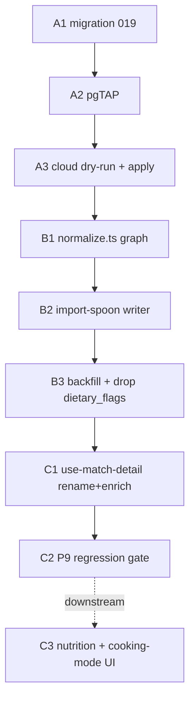

# Database Refactor — Implementation Workflow

**Status:** workflow (2026-05-23). Inputs: [../README.md](../README.md) (requirements), [../DESIGN/README.md](../DESIGN/README.md) (design). Execute via `/sc:implement` (edits routed through codeagent, TDD, per-unit verification).

Three lockstep phases (D4). **Each work unit: tests-first, then `tsc`+`lint`+Jest/pgTAP, then commit.** Gates between phases are hard — don't start the next phase until the prior gate is green.

---

## Phase P-A — Schema migration (DB only)

**A1 — Write `supabase/migrations/019_recipe_catalog_normalization.sql`**
- ALTER `recipes` (add target columns; keep uuid PK + `external_id` + `raw_payload` + `is_complete`).
- ALTER `recipe_ingredients` (rename `ext_ingredient_id→spoonacular_ingredient_id`, `original_text→original`, `image_url→image`, `position→sort_order`; add `consistency`, `original_name`, `meta`).
- CREATE 11 child tables (uuid PK, `recipe_id`/parent uuid FK `on delete cascade`) per DESIGN §5.
- RLS enable + `<t>_auth_read` policy per table (DESIGN §6). Indexes per DESIGN §7. `recipe_completeness` view (DESIGN §4).
- Do **not** drop `dietary_flags` yet (B3 drops it post-backfill).

**A2 — pgTAP** `supabase/tests/recipe_catalog_normalization.sql`
- Authed SELECT allowed / anon denied on every new table.
- `system` + `tag_type` CHECK constraints reject bad values.
- FK cascade: deleting a recipe removes children.
- `recipe_completeness` view returns expected booleans on a seeded fixture.

**A3 — Verify + apply**
- Run via savepoint-munging cloud dry-run (NFR5); then apply to cloud `tkizdngomjrgrmpancyz`.
- **Gate A:** pgTAP green on cloud; 11 tables + altered columns live; existing `recipes`/`recipe_ingredients` rows intact (renamed columns carry data).

> ⚠️ Between A3 and B3 the app's `use-match-detail` reads stale column names (`original_text`/`position`) — expected red under D4 lockstep. Keep P-A→P-B→P-C tight.

---

## Phase P-B — Ingestion rewrite + backfill (depends on Gate A)

**B1 — `scripts/ingestion/normalize.ts` → pure graph normalizer** (TDD, fixtures in `RecipeJson/`)
- Extend `SpoonRecipe` type: `nutrition{nutrients[],properties[],flavonoids[],ingredients[{nutrients[]}]}`, `analyzedInstructions[{name,steps[{number,step,length{number,unit},ingredients[],equipment[]}]}]`, ingredient `measures{us,metric}`, `cuisines/dishTypes/diets/occasions`, dietary booleans.
- Emit `NormalizationResult` graph (DESIGN §8). Tighten `is_complete` = title+image+≥1 ingredient+≥1 instruction step+Calories nutrient (DESIGN §4).
- Keep pure (no Supabase import). New fixture tests for nutrition/instruction/tag/measure branches + missing-branch tolerance (R2).

**B2 — `scripts/ingestion/import-spoon.ts` → graph writer** (tests)
- Upsert `recipes` on `external_id`; delete-and-reinsert all child rows in one transaction; preserve `sort_order`; set `is_complete` from the graph; bump `updated_at`.
- Idempotency test: re-running the same payload yields identical row counts (no dupes).

**B3 — Backfill + cleanup**
- Pause the 2h cron (NFR4).
- Backfill script: drive B1/B2 from `recipes.raw_payload` for the ~70 cloud rows.
- Verify `recipe_completeness.should_be_complete = is_complete` for all rows.
- Migrate `dietary_flags` jsonb → boolean columns, then `ALTER TABLE recipes DROP COLUMN dietary_flags`.
- Resume cron; confirm next tick writes the full graph.
- **Gate B:** 70 recipes fully exploded; completeness view consistent; importer idempotent; Jest green; cron healthy.

---

## Phase P-C — App alignment (depends on Gate B)

**C1 — `src/lib/use-match-detail.ts` + tests**
- Update column reads: `original_text→original`, `position→sort_order`.
- Add `nutrients` (Calories + macros, FR6) and ordered `instructionSteps` (FR7) to `MatchDetail` (extend nested select, or add `use-recipe-nutrition`/`use-recipe-instructions` hooks per DESIGN §9).

**C2 — Regression gate**
- Confirm `use-deck` / `use-pod-matches` / `use-session-matches` unchanged (uuid preserved).
- Full Jest suite + coverage gate (≥90% line / ≥80% branch, NFR2); `tsc` + `lint` clean.
- **Gate C:** all green; P9 swipe/cookbook surfaces behave exactly as before.

**C3 — Downstream feature UI (NOT part of refactor "done")**
- Nutrition panel on cookbook detail (FR6); cooking-mode step view (FR7). Track as a separate feature slice after the refactor lands.

---

## Cross-cutting

- **Cron coordination:** pause before B3, resume after B3 verifies. The rewritten importer must be live before resume (lockstep).
- **Rollback:** P-A is additive except the `recipe_ingredients` renames + (later) `dietary_flags` drop. Keep `019` reversible notes; a `git revert` of P-C + restoring the importer is the fast path if B3 mis-backfills (raw_payload is the source of truth, so re-running backfill is safe).
- **Verification spine:** pgTAP (P-A), Jest fixtures (P-B), full suite + coverage (P-C). Cloud-only via dry-run pattern (local Docker space-constrained).

## Estimate (relative)

| Phase | Effort | Risk |
|---|---|---|
| P-A migration + pgTAP | M | low (additive) |
| P-B normalize graph + writer + backfill | **L** | **high** (R1 nested upsert, R2 partial payloads) |
| P-C hooks + regression | S–M | low (uuid preserved) |

## Definition of done (the refactor)

All 13 tables live with RLS/indexes; 70 recipes backfilled and completeness-consistent; cron resumed writing the full graph idempotently; `dietary_flags` dropped; P9 surfaces unchanged; full suite + coverage green. (C3 UI is tracked separately.)
