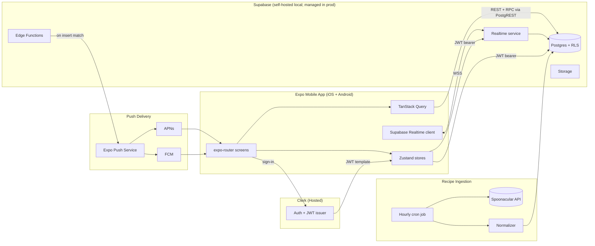
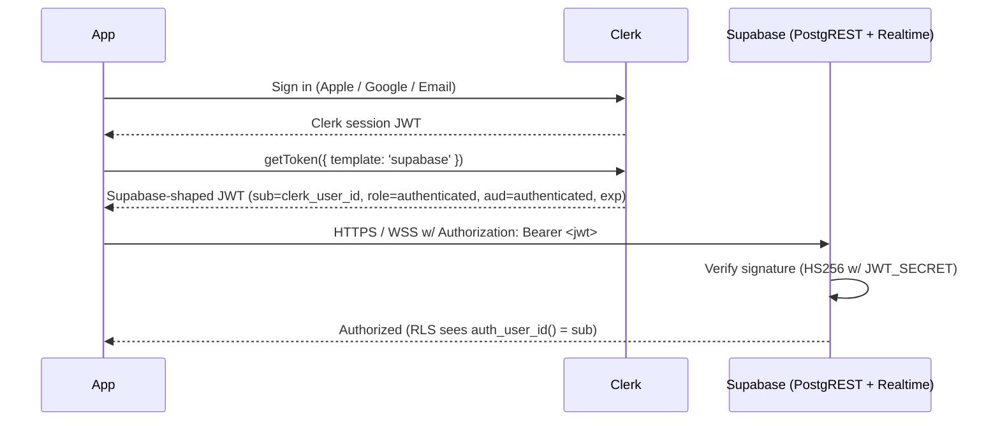
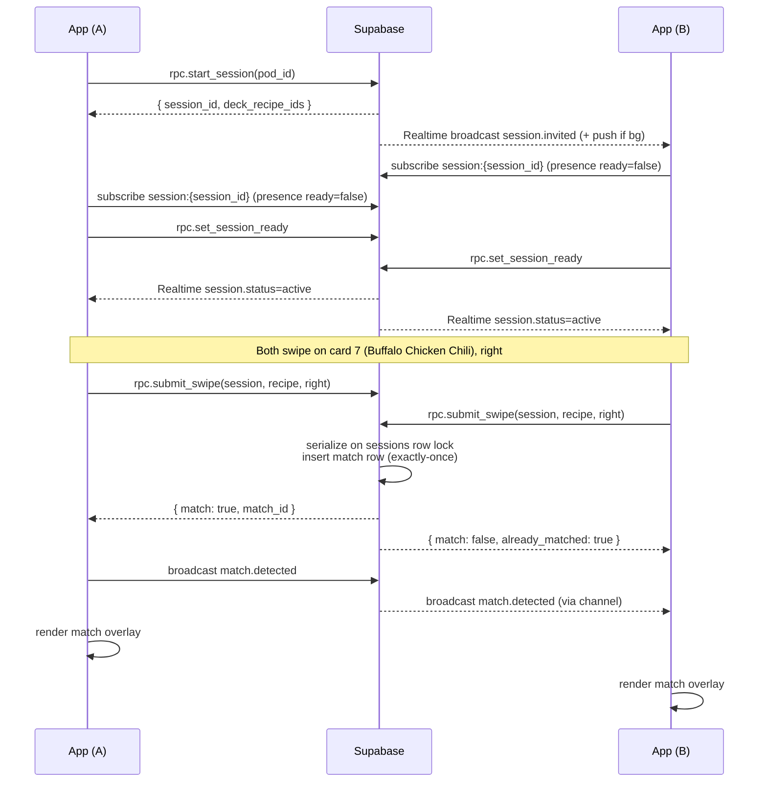
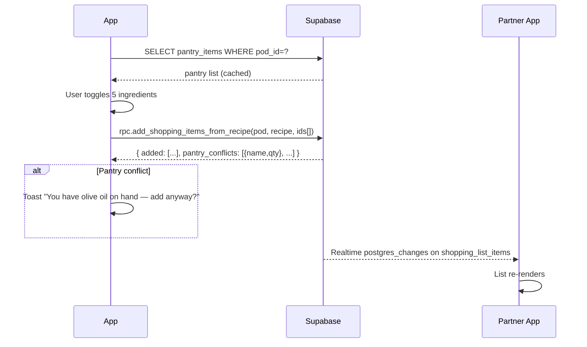

# cookDaddy — System Design

**Status:** Draft v1
**Owner:** Fontez Brooks
**Last updated:** 2026-05-21
**Source PRD:** [`docs/PRD/README.md`](../PRD/README.md)
**Companion specs:** [`docs/MATCH-UX/README.md`](../MATCH-UX/README.md) (match celebration motion / haptic / audio spec).
**Scope:** Architecture, schema + RLS, realtime channels, deep links, push, auth bridge, sequence diagrams, analytics.

> **Out of scope:** Implementation code (see `/sc:implement`) and ops/CI/CD detail (see `/sc:workflow`). Match-overlay UX detail lives in the MATCH-UX doc above.

---

## 1. Design Goals & Constraints (recap)

| # | Goal | Constraint |
|---|---|---|
| D1 | Sub-second match latency between two paired clients. | NFR-P2: p95 < 800ms broadband. |
| D2 | Exactly-once match per (pod, recipe). | NFR-R2. |
| D3 | All pod data fully isolated by row-level security. | NFR-S2. |
| D4 | Dietary profile never leaks to partner. | NFR-S3. |
| D5 | One Expo codebase ships iOS + Android. | PRD §6.1. |
| D6 | Realtime layer uses Supabase Realtime — no extra vendor. | PRD §6.4. |
| D7 | 90% test coverage; deterministic match logic. | NFR-Q2. |

---

## 2. System Architecture



**Source of truth:** Postgres. All swipes, matches, shopping-list edits, and pantry mutations write to DB first; Realtime is the propagation layer, not the truth.

**Trust boundary:** Anything between the client and Postgres is enforced by RLS. Edge Functions run with service role only for server-controlled ops (match notification fan-out, invite token signing).

---

## 3. Data Model — DDL & RLS

> Schema lives in `supabase/migrations/*`. All timestamps `timestamptz`. UUIDs unless noted. Names use `snake_case`.

### 3.1 Enums

```sql
create type swipe_direction as enum ('right', 'left');
create type session_status  as enum ('lobby', 'active', 'ended');
create type session_end_reason as enum ('completed', 'user_ended', 'partner_disconnect', 'timeout');
create type dietary_hard as enum (
  'vegan','vegetarian','pescatarian','gluten_free','dairy_free',
  'nut_free','peanut_free','shellfish_free','egg_free','soy_free','pork_free','beef_free','halal','kosher'
);
create type dietary_soft as enum (
  'low_carb','low_sodium','low_sugar','high_protein','low_fat','keto','paleo','mediterranean'
);
```

### 3.2 Tables

```sql
-- 3.2.1 Users (mirrors Clerk for FK joins; populated via clerk webhook → edge fn)
create table users (
  id            text primary key,        -- = clerk user id
  display_name  text not null,
  avatar_url    text,
  created_at    timestamptz not null default now(),
  updated_at    timestamptz not null default now()
);

-- 3.2.2 Dietary profile (private to user)
create table dietary_profiles (
  user_id          text primary key references users(id) on delete cascade,
  hard_exclusions  dietary_hard[] not null default '{}',
  soft_preferences dietary_soft[] not null default '{}',
  updated_at       timestamptz not null default now()
);

-- 3.2.3 Pods
create table pods (
  id          uuid primary key default gen_random_uuid(),
  created_at  timestamptz not null default now(),
  archived_at timestamptz
);

create table pod_members (
  pod_id     uuid not null references pods(id) on delete cascade,
  user_id    text not null references users(id) on delete cascade,
  joined_at  timestamptz not null default now(),
  primary key (pod_id, user_id)
);

-- enforce "one active pod per user" via partial unique index on (user_id) where pod is not archived
create unique index uq_pod_members_active_user
  on pod_members(user_id)
  where (select archived_at from pods p where p.id = pod_members.pod_id) is null;
-- NOTE: subquery in index predicate is not allowed; implement via trigger instead.
-- See section 3.3 for the trigger.

-- 3.2.4 Pod invites (share-link tokens)
create table pod_invites (
  id              uuid primary key default gen_random_uuid(),
  pod_id          uuid not null references pods(id) on delete cascade,
  inviter_user_id text not null references users(id) on delete cascade,
  token_hash      text not null unique,    -- HMAC-SHA256(token, server_secret); raw token never stored
  expires_at      timestamptz not null,
  consumed_at     timestamptz,
  consumed_by     text references users(id),
  created_at      timestamptz not null default now()
);

create index ix_pod_invites_token_hash on pod_invites(token_hash);

-- 3.2.5 Recipes (catalog from Spoonacular)
create table recipes (
  id                uuid primary key default gen_random_uuid(),
  external_id       bigint unique not null,
  title             text not null,
  image_url         text,
  source_url        text,
  source_name       text,
  credits_text      text,
  license           text,
  ready_in_minutes  int,
  servings          int,
  health_score      numeric,
  dietary_flags     jsonb not null default '{}', -- {vegan: true, gluten_free: false, ...}
  raw_payload       jsonb not null,
  is_complete       boolean not null default true, -- false if missing ingredients/instructions/image
  created_at        timestamptz not null default now()
);

create index ix_recipes_complete_dietary on recipes using gin (dietary_flags)
  where is_complete = true;

-- 3.2.6 Recipe ingredients (denormalized for fast deck filtering + shopping list)
create table recipe_ingredients (
  id              uuid primary key default gen_random_uuid(),
  recipe_id       uuid not null references recipes(id) on delete cascade,
  ext_ingredient_id bigint,
  name            text not null,
  name_clean      text,
  original_text   text,
  amount          numeric,
  unit            text,
  aisle           text,
  image_url       text,
  position        int not null
);
create index ix_recipe_ingredients_recipe on recipe_ingredients(recipe_id);

-- 3.2.7 Sessions
create table sessions (
  id              uuid primary key default gen_random_uuid(),
  pod_id          uuid not null references pods(id) on delete cascade,
  started_by      text not null references users(id),
  status          session_status not null default 'lobby',
  started_at      timestamptz not null default now(),
  ended_at        timestamptz,
  ended_reason    session_end_reason,
  deck_recipe_ids uuid[] not null  -- pre-computed deck, deterministic order
);
create index ix_sessions_pod_started on sessions(pod_id, started_at desc);

-- 3.2.8 Swipes
create table swipes (
  id          uuid primary key default gen_random_uuid(),
  session_id  uuid not null references sessions(id) on delete cascade,
  pod_id      uuid not null references pods(id) on delete cascade,  -- denormalized for RLS perf
  user_id     text not null references users(id) on delete cascade,
  recipe_id   uuid not null references recipes(id),
  direction   swipe_direction not null,
  created_at  timestamptz not null default now(),
  unique (session_id, user_id, recipe_id)
);
create index ix_swipes_pod_recipe_dir on swipes(pod_id, recipe_id, direction);
create index ix_swipes_user_dir_created on swipes(user_id, direction, created_at desc);

-- 3.2.9 Matches
create table matches (
  id          uuid primary key default gen_random_uuid(),
  pod_id      uuid not null references pods(id) on delete cascade,
  recipe_id   uuid not null references recipes(id) on delete cascade,
  session_id  uuid not null references sessions(id),
  matched_at  timestamptz not null default now(),
  cooked_at   timestamptz,
  removed_at  timestamptz,
  unique (pod_id, recipe_id)
);
create index ix_matches_pod_active on matches(pod_id) where removed_at is null;

-- 3.2.10 Ratings (per-user, per-recipe within a pod)
create table recipe_ratings (
  pod_id     uuid not null references pods(id) on delete cascade,
  recipe_id  uuid not null references recipes(id) on delete cascade,
  user_id    text not null references users(id) on delete cascade,
  stars      smallint not null check (stars between 1 and 5),
  updated_at timestamptz not null default now(),
  primary key (pod_id, recipe_id, user_id)
);

-- 3.2.11 Notes (one shared field per match)
create table recipe_notes (
  pod_id          uuid not null,
  recipe_id       uuid not null,
  body            text not null default '',
  last_edited_by  text not null references users(id),
  updated_at      timestamptz not null default now(),
  primary key (pod_id, recipe_id),
  foreign key (pod_id, recipe_id) references matches(pod_id, recipe_id) on delete cascade
);

-- 3.2.12 Shopping list
create table shopping_list_items (
  id                uuid primary key default gen_random_uuid(),
  pod_id            uuid not null references pods(id) on delete cascade,
  name              text not null,
  quantity          numeric,
  unit              text,
  category          text,      -- "aisle" from Spoonacular when applicable
  source_recipe_id  uuid references recipes(id),
  added_by_user_id  text not null references users(id),
  checked_at        timestamptz,
  created_at        timestamptz not null default now(),
  updated_at        timestamptz not null default now()
);
create index ix_shopping_list_pod_checked on shopping_list_items(pod_id, checked_at);

-- 3.2.13 Pantry
create table pantry_items (
  id                  uuid primary key default gen_random_uuid(),
  pod_id              uuid not null references pods(id) on delete cascade,
  name                text not null,
  name_clean          text,                  -- lowercased, singularized for matching
  quantity            numeric,
  unit                text,
  expires_at          timestamptz,
  updated_by_user_id  text not null references users(id),
  created_at          timestamptz not null default now(),
  updated_at          timestamptz not null default now()
);
create unique index uq_pantry_pod_name on pantry_items(pod_id, name_clean);

-- 3.2.14 Push tokens
create table push_tokens (
  user_id     text not null references users(id) on delete cascade,
  expo_token  text primary key,
  platform    text not null check (platform in ('ios','android')),
  created_at  timestamptz not null default now(),
  last_seen   timestamptz not null default now()
);
```

### 3.3 Constraints & triggers (business rules)

```sql
-- One active pod per user. Enforced via trigger because RLS-style index predicates can't subquery.
create or replace function check_one_active_pod() returns trigger as $$
begin
  if exists (
    select 1
    from pod_members pm
    join pods p on p.id = pm.pod_id
    where pm.user_id = new.user_id
      and p.archived_at is null
      and pm.pod_id <> new.pod_id
  ) then
    raise exception 'user % already belongs to an active pod', new.user_id
      using errcode = 'P0001';
  end if;
  return new;
end;
$$ language plpgsql;

create trigger trg_one_active_pod
  before insert on pod_members
  for each row execute function check_one_active_pod();

-- Pod must have exactly 2 members before sessions can start. Enforced at session insert.
create or replace function check_pod_full() returns trigger as $$
begin
  if (select count(*) from pod_members where pod_id = new.pod_id) <> 2 then
    raise exception 'pod % must have exactly 2 members to start a session', new.pod_id
      using errcode = 'P0001';
  end if;
  return new;
end;
$$ language plpgsql;

create trigger trg_pod_full_for_session
  before insert on sessions
  for each row execute function check_pod_full();
```

### 3.4 Helper: is_pod_member

```sql
create or replace function is_pod_member(p_pod_id uuid, p_user_id text)
returns boolean
language sql stable
as $$
  select exists (
    select 1 from pod_members
    where pod_id = p_pod_id and user_id = p_user_id
  );
$$;

-- auth.uid() returns the Clerk user id (text) per JWT claim mapping (see §4)
create or replace function auth_user_id() returns text
language sql stable as $$
  select coalesce(
    nullif(current_setting('request.jwt.claims', true), '')::jsonb ->> 'sub',
    ''
  );
$$;
```

### 3.5 RLS policies (sketch — full set in migrations)

```sql
alter table users enable row level security;
alter table dietary_profiles enable row level security;
alter table pods enable row level security;
alter table pod_members enable row level security;
alter table pod_invites enable row level security;
alter table sessions enable row level security;
alter table swipes enable row level security;
alter table matches enable row level security;
alter table recipe_ratings enable row level security;
alter table recipe_notes enable row level security;
alter table shopping_list_items enable row level security;
alter table pantry_items enable row level security;
alter table push_tokens enable row level security;
-- recipes & recipe_ingredients are public read (catalog), no write from client
alter table recipes enable row level security;
alter table recipe_ingredients enable row level security;

-- USERS: can read self + pod partner (for display names), write only self.
create policy users_self_read on users for select
  using (id = auth_user_id() or exists (
    select 1 from pod_members pm1
    join pod_members pm2 on pm1.pod_id = pm2.pod_id
    where pm1.user_id = auth_user_id() and pm2.user_id = users.id
  ));
create policy users_self_write on users for update
  using (id = auth_user_id()) with check (id = auth_user_id());

-- DIETARY PROFILES: strict self-only. Never readable by partner.
create policy dp_self on dietary_profiles for all
  using (user_id = auth_user_id())
  with check (user_id = auth_user_id());

-- PODS: members can read.
create policy pods_member_read on pods for select
  using (is_pod_member(id, auth_user_id()));
create policy pods_member_update on pods for update
  using (is_pod_member(id, auth_user_id()))
  with check (is_pod_member(id, auth_user_id()));

-- POD_MEMBERS: members can read; only edge fn (service role) can insert (via invite consumption).
create policy pm_read on pod_members for select
  using (is_pod_member(pod_id, auth_user_id()));

-- POD_INVITES: only inviter can read their own invites; consumption via RPC under service role.
create policy invites_owner_read on pod_invites for select
  using (inviter_user_id = auth_user_id());

-- SESSIONS, SWIPES, MATCHES, RATINGS, NOTES, SHOPPING, PANTRY: pod-scoped read+write
create policy s_pod on sessions for all
  using (is_pod_member(pod_id, auth_user_id()))
  with check (is_pod_member(pod_id, auth_user_id()));

create policy sw_pod_read on swipes for select
  using (is_pod_member(pod_id, auth_user_id()));
create policy sw_self_insert on swipes for insert
  with check (user_id = auth_user_id() and is_pod_member(pod_id, auth_user_id()));

create policy m_pod on matches for all
  using (is_pod_member(pod_id, auth_user_id()))
  with check (is_pod_member(pod_id, auth_user_id()));

create policy rr_pod_read on recipe_ratings for select
  using (is_pod_member(pod_id, auth_user_id()));
create policy rr_self_write on recipe_ratings for insert
  with check (user_id = auth_user_id() and is_pod_member(pod_id, auth_user_id()));
create policy rr_self_update on recipe_ratings for update
  using (user_id = auth_user_id());

create policy rn_pod on recipe_notes for all
  using (is_pod_member(pod_id, auth_user_id()))
  with check (is_pod_member(pod_id, auth_user_id()));

create policy sli_pod on shopping_list_items for all
  using (is_pod_member(pod_id, auth_user_id()))
  with check (is_pod_member(pod_id, auth_user_id()));

create policy pi_pod on pantry_items for all
  using (is_pod_member(pod_id, auth_user_id()))
  with check (is_pod_member(pod_id, auth_user_id()));

create policy pt_self on push_tokens for all
  using (user_id = auth_user_id())
  with check (user_id = auth_user_id());

-- RECIPES: public read for authenticated; no writes from client
create policy recipes_auth_read on recipes for select
  using (auth_user_id() <> '');
create policy ri_auth_read on recipe_ingredients for select
  using (auth_user_id() <> '');
```

**Key RLS guarantee tests** (to write before merging migrations):
- A user cannot SELECT another pod's `swipes`, `matches`, `shopping_list_items`, `pantry_items`.
- A user cannot SELECT their partner's `dietary_profiles` row.
- A user cannot INSERT a `swipe` with `user_id != auth_user_id()`.
- A non-member cannot read a pod's invite tokens.

---

## 4. Auth Bridge — Clerk ↔ Supabase



**Clerk JWT template config (`supabase`):**
```json
{
  "aud": "authenticated",
  "role": "authenticated",
  "sub": "{{user.id}}",
  "email": "{{user.primary_email_address}}",
  "name": "{{user.full_name}}",
  "iat": "{{date.now}}",
  "exp": "{{date.now + 3600}}"
}
```

**Supabase config:** signing secret = Clerk's JWT template signing key (HS256 shared secret). Set as `JWT_SECRET` in Supabase project.

**Clerk → users sync:** Clerk webhook (`user.created`, `user.updated`, `user.deleted`) → Edge Function `clerk-user-webhook` → upserts row in `users` table. Webhook secret validated via Svix.

---

## 5. API Surface (PostgREST + RPCs)

Most data flows through PostgREST auto-generated CRUD with RLS. Only operations needing **server-side logic, atomicity, or service-role privilege** are exposed as RPCs (Postgres functions callable as `POST /rest/v1/rpc/<name>`).

### 5.1 RPC catalog

| RPC | Purpose | Auth | Notes |
|---|---|---|---|
| `create_pod_invite()` | Create invite, return raw token | authenticated, must not be in a pod (or returns existing pod) | Server hashes token; client gets raw once. |
| `consume_pod_invite(token text)` | Atomically join inviter's pod | authenticated, must not be in a pod | Validates token hash + expiry; inserts `pod_members`; marks invite consumed. |
| `dissolve_pod(pod_id uuid)` | Archive pod, soft-delete shared artifacts. | pod member | Sets `pods.archived_at`; emits `pod.dissolved` realtime event. |
| `start_session(pod_id uuid)` | Build deck, create session row, set status='lobby'. | pod member | Returns `session_id` + `deck_recipe_ids`. |
| `set_session_ready(session_id uuid)` | Mark caller ready; if both ready, flip to 'active'. | pod member of session's pod | Idempotent. |
| `end_session(session_id uuid, reason session_end_reason)` | Finalize session. | pod member | Idempotent on already-ended. |
| `submit_swipe(session_id, recipe_id, direction)` | Insert swipe + detect match atomically. | pod member | Returns `{match: bool, match_id?: uuid}`. See §7. |
| `build_deck(pod_id uuid, size int default 20)` | Internal helper. Compute deck per FR-S3. | called by `start_session` | Pure SQL, deterministic on inputs. |
| `add_shopping_items_from_recipe(pod_id, recipe_id, ingredient_ids[])` | Bulk add with pantry-aware dedup hint. | pod member | Returns added IDs + pantry-conflicts. |

### 5.2 Direct PostgREST (no RPC needed)
- Read/update `dietary_profiles` (self only via RLS).
- Read/write `shopping_list_items`, `pantry_items` (CRUD).
- Read `matches`, `recipe_ratings`, `recipe_notes`; write own ratings + shared notes.
- Read `recipes`, `recipe_ingredients` (catalog).
- Read pod-scoped `sessions`, `swipes` (write only via RPC).

### 5.3 Deck-build algorithm (`build_deck`)

```text
INPUT: pod_id, size
1. Resolve members → user_a, user_b.
2. hard_exclude = dietary_profiles(user_a).hard_exclusions
               ∪ dietary_profiles(user_b).hard_exclusions
3. excluded_recipes =
     (recipes that match any hard_exclude via dietary_flags)
     ∪ (recipes where pod has right-swiped — i.e., already matched)
     ∪ (recipes where either user left-swiped within last 30 days)
4. candidates = recipes WHERE is_complete = true AND NOT IN excluded_recipes
5. ORDER BY soft-preference rank desc, random() with seed = session_id  (deterministic)
6. LIMIT size
RETURN deck_recipe_ids
```

Implemented as a single SQL CTE chain; deterministic with `setseed(session_id::numeric)`.

---

## 6. Realtime — Channels, Events, Presence

Two channel types per pod. All channel names are pod- or session-scoped so authorization can be enforced via Realtime's RLS check on the channel topic.

### 6.1 Channel: `pod:{pod_id}` (long-lived per pod, joined on app launch)

| Purpose | Mechanism | Payload |
|---|---|---|
| Shared shopping list sync | Postgres Changes on `shopping_list_items` filtered by `pod_id` | Standard row payload |
| Shared pantry sync | Postgres Changes on `pantry_items` filtered by `pod_id` | Standard row payload |
| Cookbook updates (matches, ratings, notes, cooked) | Postgres Changes on `matches`, `recipe_ratings`, `recipe_notes` | Standard row payload |
| Pod dissolution | Broadcast event `pod.dissolved` | `{ pod_id, dissolved_by_user_id, at }` |
| Session invite (live) | Broadcast event `session.invited` | `{ session_id, started_by_user_id, started_at }` |

### 6.2 Channel: `session:{session_id}` (joined only during an active session)

| Purpose | Mechanism | Payload |
|---|---|---|
| Lobby presence | Realtime Presence | `{ user_id, ready: bool, joined_at }` |
| Swipe progress (no direction leak) | Broadcast event `swipe.progress` | `{ session_id, user_id, swiped_count, total }` |
| Match reveal | Broadcast event `match.detected` | `{ match_id, recipe_id, matched_at }` |
| Session state transitions | Broadcast event `session.status` | `{ session_id, status, ended_reason? }` |

### 6.3 Why Broadcast instead of Postgres Changes for swipes?

- **Latency.** Broadcast is < 100ms in-region. Postgres Changes adds the WAL→logical-decoding pipeline (~150–300ms).
- **Volume.** A 20-card deck × 2 users = 40 swipes / session. Tiny.
- **Durability concern is handled by the DB write.** Client emits Broadcast **only after** the `submit_swipe` RPC confirms. If Broadcast drops, the DB still has the truth and the partner's next progress poll reconciles.

### 6.4 Channel auth

Realtime applies RLS on the underlying table for Postgres Changes. For Broadcast channels, gate via custom check: a database function `can_join_channel(topic text)` that parses `pod:{uuid}` or `session:{uuid}` and verifies membership. Wired into Realtime config (`realtime.channels` policy).

---

## 7. Match Detection — Exactly-Once, Atomic

The hot path. Must be exactly-once even with simultaneous right-swipes.

### 7.1 Algorithm

`submit_swipe(session_id, recipe_id, direction)` runs inside a single transaction:

```sql
create or replace function submit_swipe(
  p_session_id uuid,
  p_recipe_id  uuid,
  p_direction  swipe_direction
) returns jsonb
language plpgsql
security definer
set search_path = public
as $$
declare
  v_user_id   text := auth_user_id();
  v_pod_id    uuid;
  v_match_id  uuid;
  v_partner   text;
  v_existing  boolean;
begin
  -- 1) Resolve & authorize via session
  select s.pod_id into v_pod_id
  from sessions s
  where s.id = p_session_id and s.status = 'active'
  for update;  -- lock the session row to serialize match logic for this pod

  if v_pod_id is null then
    raise exception 'session not active';
  end if;

  if not is_pod_member(v_pod_id, v_user_id) then
    raise exception 'forbidden';
  end if;

  -- 2) Insert swipe (uniqueness prevents duplicates)
  insert into swipes(session_id, pod_id, user_id, recipe_id, direction)
  values (p_session_id, v_pod_id, v_user_id, p_recipe_id, p_direction)
  on conflict (session_id, user_id, recipe_id) do nothing;

  -- 3) If left, done
  if p_direction = 'left' then
    return jsonb_build_object('match', false);
  end if;

  -- 4) Match detection — partner has a right-swipe for this recipe in this pod (any session)?
  select pm.user_id into v_partner
  from pod_members pm
  where pm.pod_id = v_pod_id and pm.user_id <> v_user_id;

  select exists (
    select 1 from swipes
    where pod_id = v_pod_id
      and user_id = v_partner
      and recipe_id = p_recipe_id
      and direction = 'right'
  ) into v_existing;

  if not v_existing then
    return jsonb_build_object('match', false);
  end if;

  -- 5) Insert match (unique constraint guarantees exactly-once)
  insert into matches(pod_id, recipe_id, session_id)
  values (v_pod_id, p_recipe_id, p_session_id)
  on conflict (pod_id, recipe_id) do nothing
  returning id into v_match_id;

  if v_match_id is null then
    -- Already matched (e.g., from a prior session). Don't re-emit.
    return jsonb_build_object('match', false, 'already_matched', true);
  end if;

  return jsonb_build_object('match', true, 'match_id', v_match_id);
end;
$$;
```

### 7.2 Post-RPC client behavior

```text
Client A swipes right
  ├─ POST /rpc/submit_swipe → { match: true, match_id }
  ├─ Broadcast `swipe.progress` on session:{id}
  └─ Broadcast `match.detected` on session:{id}    ◄── triggers overlay on both clients
Client B (receiving)
  └─ Renders match overlay from broadcast payload
```

A Postgres `AFTER INSERT` trigger on `matches` also fires an Edge Function for push notification (if either client is backgrounded). Trigger uses `pg_notify` → Edge Function listens via Supabase webhooks.

### 7.3 Race-condition analysis

Two simultaneous right-swipes on the same recipe in the same session:
1. Both swipes go through `submit_swipe`.
2. The `for update` lock on `sessions` serializes them.
3. The second swipe's `exists` check sees the first swipe → inserts a match.
4. The first swipe's `exists` check sees no partner swipe yet → no match.
5. Unique constraint on `matches(pod_id, recipe_id)` is the final backstop.

Exactly one match row. Both clients receive the broadcast.

---

## 8. Deep Link / Invite Flow

### 8.1 URL design

- **Universal Link (iOS) / App Link (Android):** `https://cookdaddy.app/i/{token}` (preferred; verifies via AASA / assetlinks.json — no app-switching error if uninstalled).
- **Custom scheme fallback:** `cookdaddy://invite?token={token}`.

### 8.2 Token

- 32-byte cryptographic random, base64url-encoded → ~43 chars.
- Server stores `HMAC-SHA256(token, server_secret)` in `pod_invites.token_hash`.
- TTL 24h; single use; revoked on `dissolve_pod`.

### 8.3 Routing (expo-router)

```
app/
  (auth)/
    sign-in.tsx
  (app)/
    _layout.tsx
    home.tsx
    invite/
      [token].tsx        ◄── deep link target
    session/
      [sessionId].tsx
    cookbook/
      index.tsx
      [matchId].tsx
    shopping.tsx
    pantry.tsx
    settings/
      profile.tsx
      dietary.tsx
      notifications.tsx
```

`invite/[token].tsx`:
```text
on mount:
  if !signed_in → push to sign-in with redirect=`invite/{token}`
  call rpc.consume_pod_invite(token)
  on success → router.replace('/home')
  on expired → show "link expired" screen
  on already_in_pod → show "leave current pod?" prompt
```

### 8.4 No-app-installed path

- AASA `apple-app-site-association` + Android `assetlinks.json` served from `cookdaddy.app/.well-known/`.
- If app is missing, the same URL falls through to a static web page with App Store / Play Store CTAs and the token in a `?token=` query param — preserved across install via Branch-style attribution (post-MVP), or simply by the user re-tapping the original message link after install (MVP behavior; acceptable per FR-P3).

---

## 9. Push Notifications

### 9.1 Topology

```
Postgres trigger on matches insert
   └─► pg_notify('match_created', payload)
            └─► Edge Function `fan-out-push` (subscribed via Realtime DB webhook)
                    └─► POST https://exp.host/--/api/v2/push/send
                            └─► APNs / FCM
                                    └─► Device
```

### 9.2 Triggers (v1)

| Event | Recipient | Title / Body |
|---|---|---|
| `session.invited` (partner started a session) | The other partner | "{Name} wants to swipe! 🥘" / "Tap to join." |
| `match.detected` and recipient is backgrounded | Both partners | "It's a match! 🎉" / "{Recipe title}" |
| `pod_invite.consumed` | Inviter | "{Name} joined your pod!" / Empty body. |

### 9.3 Payload format (Expo)

```json
{
  "to": "ExponentPushToken[...]",
  "title": "It's a match! 🎉",
  "body": "Best Buffalo Chicken Chili",
  "data": {
    "type": "match",
    "pod_id": "...",
    "recipe_id": "...",
    "match_id": "...",
    "deep_link": "cookdaddy://cookbook/<match_id>"
  },
  "sound": "default",
  "priority": "high",
  "ttl": 3600
}
```

### 9.4 Token lifecycle

- App requests permission **after first pod is created**.
- On grant, calls `expo-notifications.getExpoPushTokenAsync()` and POSTs to `push_tokens` (upsert on `expo_token` PK).
- `last_seen` updated on each app foreground.
- Tokens not seen in 30 days are pruned by a daily cron in Postgres.

---

## 10. Frontend Architecture

### 10.1 Routing (expo-router file tree)
See §8.3.

### 10.2 State stores (Zustand)

| Store | Owns | Persistence |
|---|---|---|
| `useAuthStore` | Clerk session, Supabase JWT, current user | MMKV |
| `usePodStore` | Active pod, partner info, presence | Memory |
| `useSessionStore` | Active session id, deck, swipe progress, match overlay state | Memory |
| `useShoppingStore` | Local optimistic shopping list | TanStack Query cache (no Zustand needed) |

### 10.3 Realtime client wiring

```text
On sign-in:
  └─ create Supabase client with Clerk JWT
On pod loaded:
  └─ subscribe to channel `pod:{pod_id}`
       ├─ postgres_changes on matches, recipe_notes, recipe_ratings, shopping_list_items, pantry_items
       └─ broadcast on session.invited, pod.dissolved
On session start:
  └─ subscribe to channel `session:{session_id}`
       ├─ presence (publish self ready)
       └─ broadcast on swipe.progress, match.detected, session.status
On session end / unmount:
  └─ unsubscribe session channel; pod channel stays
```

### 10.4 Swipe deck UX

- `react-native-reanimated` worklets keep the gesture on the UI thread.
- Card stack: top card interactive + 2 cards pre-rendered behind.
- Deck pre-fetched at session start (FR-NFR-P4); per-card data already in memory.
- Like / Dislike buttons mirror swipe gestures for accessibility (NFR-A4).
- Match overlay is a separate top-level portal — does not unmount the deck.

---

## 11. Sequence Diagrams

### 11.1 Pairing

```mermaid
sequenceDiagram
  participant A as Partner A
  participant App_A as App (A)
  participant SB as Supabase
  participant App_B as App (B)
  participant B as Partner B

  A->>App_A: Tap "Invite partner"
  App_A->>SB: rpc.create_pod_invite()
  SB-->>App_A: { token, expires_at, pod_id }
  App_A->>A: Share sheet (https://cookdaddy.app/i/{token})
  A->>B: Sends link via iMessage
  B->>App_B: Tap link
  App_B->>App_B: Route /invite/[token]
  alt Not signed in
    App_B->>App_B: Push /sign-in?redirect=invite/{token}
    B->>App_B: Sign in (Clerk)
    App_B->>App_B: Resume /invite/[token]
  end
  App_B->>SB: rpc.consume_pod_invite(token)
  SB->>SB: Validate hash, expiry, single-use
  SB->>SB: Insert pod_members; mark invite consumed
  SB-->>App_B: { pod_id }
  SB-->>App_A: Realtime: pod.member_joined
  App_A->>A: Push: "{B's name} joined your pod!"
```

### 11.2 Live session + match



### 11.3 Match → shopping list with pantry check



---

## 12. Test Strategy Hooks

Designed so that 90% coverage (NFR-Q2) is achievable, not aspirational.

| Layer | Surface | Tool | Sample tests |
|---|---|---|---|
| Pure logic | `build_deck` ordering, dietary filter set math, pantry-match heuristics | Jest unit | `build_deck excludes any recipe matching nut_free for either partner` |
| SQL / RLS | Policy enforcement | pgTAP via Supabase local | `user_b cannot select user_a dietary_profiles row` |
| RPC | `submit_swipe` paths | Integration: spin Supabase local, sign two JWTs | `simultaneous right-swipes produce exactly one match row` |
| Realtime | Channel auth | Integration | `non-member cannot join session:{id}` |
| UI components | Swipe gestures, match overlay | @testing-library/react-native | `right swipe triggers onLike with recipeId` |
| E2E | Pairing → match → shopping | Maestro | `full happy path on two simulators` |

---

## 13. Failure Modes & Mitigations

| Failure | User impact | Mitigation |
|---|---|---|
| Partner disconnects mid-session | Session paused | 60s grace; auto-resume; otherwise session ended with `partner_disconnect`. |
| Realtime channel drops mid-session | Stale UI | Auto-reconnect (exp backoff, max 30s); on reconnect, re-fetch session + swipes to reconcile. |
| Swipe RPC fails (network) | Lost swipe | Client queues swipe in MMKV; retries with idempotency via `unique(session_id, user_id, recipe_id)`. |
| Deck exhausted before any match | Bad UX | "Session complete — no matches" screen with "Try again with looser filters?" CTA. |
| Spoonacular API quota exhausted | No new recipes | Cron skips and logs; existing catalog still serves decks. |
| Clerk webhook delivery fails | New user not in `users` table | Edge Function on first authenticated call upserts user as fallback. |

---

## 14. Decisions Log

| # | Decision | Rationale |
|---|---|---|
| D-1 | All match logic server-side via RPC + Postgres trigger | Exactly-once safety; RLS-compatible; no client trust. |
| D-2 | Broadcast for swipe events; Postgres Changes for shared lists | Latency-tier appropriate; durability via DB write. |
| D-3 | Clerk user IDs as text PKs (not UUIDs) | Direct mapping from JWT `sub`; simpler than maintaining a parallel UUID. |
| D-4 | One active pod per user enforced by trigger, not partial index | Postgres rejects subqueries in index predicates. |
| D-5 | Universal Links primary; custom scheme fallback only | Robustness across iMessage / Gmail / WhatsApp; no app-switching errors. |
| D-6 | Match detection uses pod-wide history (any session), not per-session | A right-swipe by both partners across any session is still a match. Matches FR-S6. |
| D-7 | Deck deterministic via `setseed(session_id)` | Both clients render identical card order without round-trip negotiation. |
| D-8 | `pantry_items.name_clean` + `unique(pod_id, name_clean)` | Enables fast pantry-aware lookup; prevents duplicate "olive oil" / "Olive Oil" entries. |
| D-9 | Push fan-out via Edge Function listening to DB webhook (not Postgres `pg_notify` direct) | Supabase webhooks are the supported, reliable channel; `pg_notify` does not survive replica failover. |
| D-10 | Notes stored as one shared text field per (pod, recipe) | Matches PRD US-5; concurrent edits via last-write-wins debounce in client. |

---

## 15. Open Questions — Resolved 2026-05-21

All PRD-level questions resolved. Implementation impact:

| Question | Resolution | Design impact |
|---|---|---|
| Spoonacular ToS | Rights confirmed. | §3.2.5 `recipes.raw_payload` is freely rehydrated to client; recipe detail screen renders full instructions. No link-out fallback. |
| Re-pairing after dissolution | Fresh pod, no recovery. | `dissolve_pod` hard-archives. No "restore cookbook" RPC needed. Old `pods.archived_at` row retained for 30-day window per FR-P4, then hard-deleted. |
| Fuzzy ingestion dedup | Post-MVP. | Ingestion writes `external_id` only; no fuzzy match in v1. Track via PostHog `recipe_apparent_duplicate` event for sizing. |
| i18n | English only v1. | Strings inline in TSX (no `react-i18next` yet); copy file `app/copy.ts` for centralized text. Locale infra deferred. |
| Analytics vendor | PostHog. | See §17 below. |
| Partner-removed-me UX | Dedicated screen. | App-launch effect: query active pod; if user has none and last membership was dissolved by partner, route to `/pod-ended` screen. See §10.4. |
| Push permission timing | After first pod created. | App layout effect: when `pod_members.joined_at` is newly set for user, prompt for `expo-notifications` permission. Track outcome via PostHog. |
| Match-overlay UX | First-class spec in MATCH-UX doc. | Client-side concern only; no schema/API change. PostHog events `match_revealed`, `match_overlay_dismissed`, `settings_vibes_changed` added. |
| Deck size | 20. | `start_session` RPC uses default 20; configurable via app constant. |

### Carried open questions (none currently)

New unknowns will be tracked here as they emerge during `/sc:implement`.

---

## 16. Frontend State for Resolved UX Items

### 16.1 Partner-removed-me detection (FR-P6)

```text
On app foreground / sign-in:
  fetch active pod via PostgREST
  if no active pod AND last pod_members row has corresponding pod.archived_at NOT NULL
                  AND archived_at within 30 days
                  AND user did not initiate dissolution
                  (stored client-side as 'self_dissolved_at' flag in MMKV when user taps dissolve)
    → route to /pod-ended screen
    → screen offers "Invite someone new" → rpc.create_pod_invite + share sheet
    → screen offers "Maybe later" → /home (pre-pod empty state)
```

Server-side: no schema change required; the client derives "did partner remove me" from "I didn't dissolve, but my pod is archived". The MMKV `self_dissolved_at` flag is the local hint that distinguishes the two cases.

### 16.2 Push permission prompt timing (FR-N1)

```text
On pod_members.joined_at change (Realtime subscription or post-rpc.consume_pod_invite/create_pod_invite):
  if expo-notifications permission status === 'undetermined':
    show in-app priming sheet: "Get notified when {partner} wants to swipe?"
    on Continue → request system permission
    on Skip → set MMKV flag prompted_at; reprompt allowed only after 14d
  on permission granted:
    register expo push token → upsert push_tokens
    emit PostHog event push_permission_granted
```

---

## 17. Analytics — PostHog Integration

**Vendor:** PostHog (cloud or self-host TBD; cloud for v1).

**Client SDK:** `posthog-react-native`. Initialized at app bootstrap once Clerk user is known. PostHog `distinct_id` = Clerk user id (matches our `users.id` text PK — clean joins across product analytics and our DB).

**Server SDK:** `posthog-node` in Edge Functions for server-emitted events (match created, invite consumed) — distinct_id is the relevant user id.

### 17.1 Event taxonomy

| Event name | Source | Properties |
|---|---|---|
| `app_opened` | client | platform, app_version, cold_start, locale |
| `signed_in` | client | provider (apple/google/email) |
| `pod_invite_created` | server (edge fn) | pod_id, inviter_user_id |
| `pod_invite_consumed` | server | pod_id, inviter_user_id, consumer_user_id, time_to_consume_min |
| `pod_dissolved` | server | pod_id, dissolved_by_user_id, pod_age_days, matches_at_dissolution |
| `push_permission_prompted` | client | trigger ("first_pod_created" / "reprompt") |
| `push_permission_granted` | client | platform |
| `session_started` | server | session_id, pod_id, deck_size |
| `session_ready_state` | client | session_id, both_ready_within_ms |
| `swipe` | client | session_id, recipe_id, direction, card_index, time_since_prev_swipe_ms |
| `swipe_progress_seen` | client | session_id, partner_offset (= other's card_index minus mine) |
| `match_revealed` | client | match_id, pod_id, recipe_id, session_id, variant, time_to_reveal_ms |
| `match_overlay_dismissed` | client | match_id, duration_ms, action ('cook_this' / 'keep_swiping' / 'closed') |
| `match_first_ever` | client | pod_id, time_since_pod_created_min |
| `session_ended` | server | session_id, pod_id, ended_reason, matches_count, duration_s |
| `recipe_cooked_marked` | client | match_id, recipe_id, time_since_match_h |
| `recipe_rated` | client | match_id, recipe_id, stars |
| `shopping_item_added` | client | source ('recipe' / 'manual'), pantry_conflict (bool) |
| `pantry_item_added` | client | source ('manual' / 'shopping_move') |
| `settings_vibes_changed` | client | which_setting, new_value |
| `recipe_apparent_duplicate` | server (ingestion) | external_id, title_similarity_to_existing | (sizing for post-MVP fuzzy dedup) |

### 17.2 Identification & user properties

On Clerk sign-in:
```
posthog.identify(clerkUserId, {
  display_name,
  created_at,
  platform: 'ios' | 'android',
  pod_id?: string,   // updated when joining/leaving
});
```

On pod join/leave:
```
posthog.identify(clerkUserId, { pod_id });   // null when in no pod
posthog.group('pod', podId, { created_at, member_count });
```

PostHog's `group` analytics on `pod` lets us slice metrics by pod (e.g., "matches per pod per week" cohorts) — directly useful for a 2-person-unit product.

### 17.3 Privacy

- No raw email or PII in event properties. Display name is uploaded as a user property (acceptable; required for `identify`), but not as event property.
- Dietary profile is **never** sent to PostHog.
- Swipe direction is sent in `swipe` events but is per-user and per-recipe — informative for product, low privacy cost.
- Self-host fallback documented for users in jurisdictions with strict data-residency requirements (post-MVP consideration).

### 17.4 Feature flags (PostHog free with analytics)

We get PostHog feature flags for free. Pre-allocated flags:
- `confetti_engine` — `skia` | `lottie` (perf experiment).
- `match_overlay_v2` — alternative motion sequence A/B test.
- `deck_size` — number experiment (defaults 20; can ramp 15/25 for cohort tests).
- `lite_mode_threshold` — device class string for auto-lite-mode.

---

## 18. Next Steps

1. Run `/sc:workflow` to slice this design + MATCH-UX into phased, testable work units (DB migrations → auth bridge → pod/invite → session/swipe → match RPC → realtime channels → match overlay + haptics → shopping/pantry → push → analytics → polish).
2. Stand up Supabase migrations + RLS tests as the foundation milestone (pgTAP scaffolded before any app code).
3. Provision PostHog project; capture project API key into Expo env vars.
4. Provision Clerk JWT template `supabase` and wire signing-key handoff to Supabase config.
5. Run `/sc:implement` per workflow phase.
