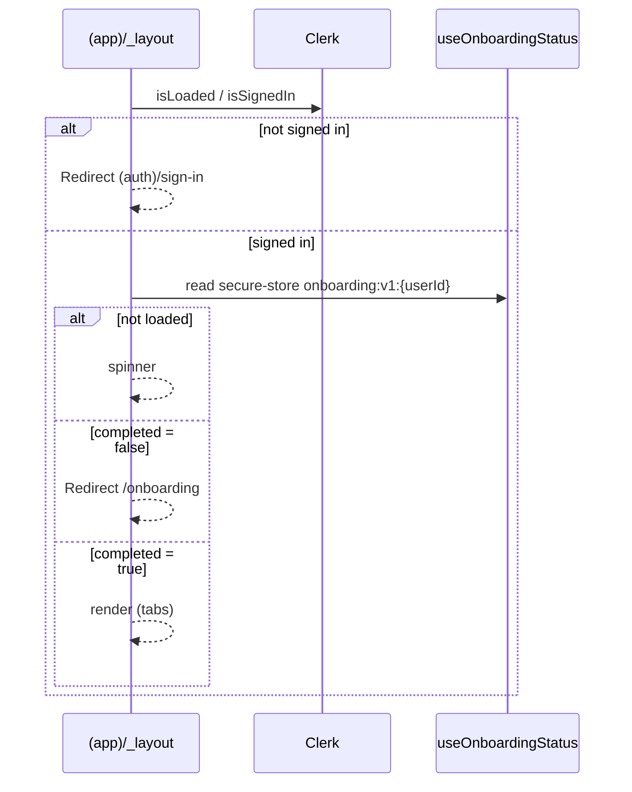

# P13 — Launch Readiness · Requirements Specification

*cookDaddy · created 2026-05-26 via `/sc:brainstorm` · scope + open questions locked*

> **Status:** Requirements locked. Next step → `/sc:design` (architecture for onboarding, fridge route, single-phone fixture).
> **Boundary:** This document is requirements only — no architecture, schemas, or code.

## Goal

Make the existing app shippable: no orphan routes, no dead weight, a guided first run, and a
visual "fridge" surface over existing pantry data — **without touching the locked recipe-matching
loop**. The ingredient-first matching pivot is explicitly deferred to **P14** (its own design
milestone, sign-off first).

## In scope / out of scope

| In (P13) | Out (→ P14) |
|---|---|
| E1 Reachability audit | Ingredient-level matching pivot |
| E2 Dead-code pass | Canonical `ingredients` table |
| E3 Onboarding (intro · pod · dietary) | Spoonacular by-ingredient seeding |
| E4 Fridge page (new route) | Any PRD / DESIGN / MATCH-UX change |
| E5 Single-phone fixture *(nice-to-have)* | |

---

## E1 — Reachability audit

**Story:** As a user, every screen the app renders is reachable from home through normal navigation.

- **FR1.1** Enumerate all routes under `src/app/(app)/*` and the components they mount.
- **FR1.2** Produce a reachability map: each route → its inbound navigation path(s) from home.
- **FR1.3** Each orphaned route is either given an inbound entry or removed (with written reason).
- **FR1.4** Intentional deep-link-only routes (e.g. `invite`) and pre-home auth screens are tagged
  exempt, not "fixed".

**Acceptance:** reachability map exists covering every route; zero untagged orphans; the map becomes
the baseline that E2 checks against.

## E2 — Dead-code pass

**Story:** As a maintainer, the codebase carries no unused exports, files, or deps.

- **FR2.1** Run static analysis (knip / ts-prune / depcheck) for unused exports, files, dependencies.
- **FR2.2** Each finding is removed **or** kept with a one-line justification.
- **FR2.3** No user-facing behavior change — validated against the E1 reachability map.
- **FR2.4 (LOCKED)** **Keep** any ingredient- / recipe-rating-related scaffolding that P14 will use
  (e.g. deferred `recipe_rated` UI, ingredient groundwork). Annotate kept items with a `// P14:` note
  so they are not re-flagged.

**Acceptance:** analysis report with every item resolved; `test`, `typecheck`, `lint` all green;
**489 tests still pass, branch coverage ≥ 82.94%**; no P14-relevant scaffolding removed.

## E3 — Onboarding *(value-prop intro · pod create/join · dietary + allergens)*

**Story:** As a new user, after sign-in I'm guided through a short setup before landing on home; I
only see it once.

- **FR3.1** First-run detection via a **local-device** flag (`onboarding_completed`); returning users
  on the same device skip straight to home. *(Trade-off accepted: reinstall / new device re-shows
  onboarding — acceptable for launch.)*
- **FR3.2** Step 1 — **value-prop intro** (swipe → match → cook). Always shown, advanceable, **not
  skippable**.
- **FR3.3** Step 2 — **pod create or join**, reusing the existing invite flow (no detour to settings).
  **Skippable** with a "do later" affordance.
- **FR3.4** Step 3 — **dietary + allergens**, reusing the existing dietary settings screen; choices
  apply to the first deck. **Skippable** with a "do later" affordance.
- **FR3.5** On completion (or skip-through) set the local flag and route to home.
- **FR3.6** Resumable: interrupting mid-flow re-enters at the first incomplete step (until the flag
  is set).
- **FR3.7** Home surfaces a **nudge** for any skipped step — required because matching needs a pod and
  the first deck quality depends on dietary input.

**Acceptance:** new user sees intro → pod → dietary then home; can create/join a pod inside
onboarding; dietary choices filter the first deck; skipping pod/dietary lands on home with a visible
nudge; onboarding never reappears on the same device once completed; emits PostHog
`onboarding_started / onboarding_step_completed / onboarding_completed` via the P12 `useAnalytics`
taxonomy.

## E4 — Fridge page *(new dedicated route, read-only)*

**Story:** As a pod member, I open a "fridge" that animates open to reveal the ingredients we
currently have.

- **FR4.1** New route `src/app/(app)/fridge` — **separate** from `pantry` (pantry stays the editable
  list).
- **FR4.2** Reads the pod's `pantry_items` via existing `use-pantry`.
- **FR4.3** On mount: fridge-door-opens reveal animation, then the ingredient list/grid.
- **FR4.4** Ingredients are **grouped by `aisle`** (data already carries `aisle`); items with no aisle
  fall into an "Other" group.
- **FR4.5** **Read-only** — no inline edit. A single **"Edit" button navigates to the `pantry` page**
  for all add/remove/edit actions.
- **FR4.6** Inbound nav entry from home (feeds E1).
- **FR4.7** Empty state when the pod has no pantry items.

**Acceptance:** `/fridge` reachable from home; shows the same data as pantry grouped by aisle; reveal
animation plays on mount and **respects the OS reduce-motion setting**; Edit button routes to
`pantry`; empty state present; emits `fridge_viewed`.

## E5 — Single-phone test fixture *(nice-to-have, cuttable)*

**Story:** As a tester, I can trigger a match solo, without a second physical device.

- **FR5.1** Seed/fixture: a test user pre-paired in a pod with a partner holding N fixed likes, so the
  tester's right-swipe produces a match.
- **FR5.2** Dev-only entry point — **never bundled or reachable in production builds**.

**Acceptance:** in a dev build a tester reaches a match state solo; absent from production; explicitly
droppable if it slips.

**DEV usage:** start local Supabase, sign into the Expo app, run
`DEV_USER_ID=<signed-in Clerk user id> pnpm dev:seed-match`, then open the printed `/session/<id>` or
tap Home's `DEV: solo match` control in a dev build.

---

## Non-functional requirements

- **No regressions:** 489 tests green, branch coverage ≥ 82.94%, `typecheck` + `lint` clean.
- **Accessibility:** fridge animation honors reduce-motion; onboarding screens are screen-reader /
  large-text friendly.
- **Analytics:** new surfaces (onboarding steps, fridge view) emit through the existing P12 PostHog
  taxonomy + consent gate — no new analytics plumbing.
- **Coding standards:** immutable patterns, ≤ 800-line files, errors handled at boundaries.
- **Security:** no new secrets. The pre-existing **`app.pod_invite_secret` rotation (HIGH)** stays on
  the launch checklist — onboarding's pod-join path exercises it.

## P14 forward reference (NOT specced here)

Additive ingredient funnel: **stage 1** ingredient swipe → pod ingredient-match → **stage 2** existing
recipe deck seeded by the matched ingredient(s), with the current instant-match overlay preserved.
Requires PRD / DESIGN / MATCH-UX deltas, a new `ingredient_swipes` entity + ingredient-match RPC, a
canonical `ingredients` table, and Spoonacular `includeIngredients` seeding. **Design sign-off before
any code.** E2 must preserve scaffolding this milestone depends on (see FR2.4).

## Locked decisions (2026-05-26)

1. **Pivot model:** additive funnel (stage 1 → 2), recipe deck + overlay preserved → **P14**.
2. **Milestone split:** P13 = launch-readiness; P14 = pivot.
3. **Onboarding steps:** value-prop intro + pod create/join + dietary/allergens (no vibes/notif step).
4. **Onboarding gating:** pod & dietary **skippable with home nudge**; intro unskippable.
5. **Onboarding flag:** **local device** (reinstall re-shows; accepted).
6. **Fridge route:** **new dedicated route**, separate from pantry.
7. **Fridge interactivity:** **read-only**, with an **Edit button that routes to pantry**.
8. **Fridge grouping:** **by aisle**.
9. **Dead-code:** **keep** ingredient / recipe-rating scaffolding P14 will use.

---
---

# P13 — Technical Design

*Produced via `/sc:design` 2026-05-26 · grounded in the current codebase · architecture & interfaces only (no implementation code).*

> **Design forks locked:** navigation IA = **tab bar**; fridge aisle = **client-side derivation** (no migration).
> **Next step → `/sc:implement`** (per epic, via `codeagent`).

## System context (as-is)

- **Routing:** expo-router. `src/app/_layout.tsx` (providers: Clerk → Query → PostHog → Theme → Stack) → `(app)/_layout.tsx` (auth guard) → flat screens. `(auth)/sign-in` pre-auth.
- **Auth/identity:** Clerk (`useAuth`), token cache in `expo-secure-store`. Supabase client built per-layout via Clerk `getToken`.
- **State:** Zustand (`usePodStore`, `useSettingsStore`), React Query for server data, Supabase realtime for pod-scoped tables.
- **Data access pattern:** RPCs for writes/logic (`createPodInvite`, `startSession`, `add_shopping_items_from_recipe`); typed `useQuery` hooks for reads (`usePantry`, `useShoppingList`).
- **Animation:** reanimated 4 + gesture-handler; `useReducedMotion()` already collapses motion to a 250 ms crossfade (MATCH-UX §12).
- **Analytics:** P12 `useAnalytics()` wrapper + consent gate; PostHog provider gated on key.
- **Storage available:** `expo-secure-store` (no AsyncStorage/MMKV — do not add one).

---

## E1 — Navigation IA: tab bar

**Problem:** Home links only to session, settings/pod, settings/profile, shopping. Orphaned from home: `cookbook`, `pantry`, `settings/{dietary,vibes,notifications}`.

**Target structure** (move screens under a tabs group; stacks nested where a section has detail screens):

```
(app)/_layout.tsx              # auth + onboarding guard → Stack
  (tabs)/_layout.tsx           # <Tabs>: Home · Cookbook · Fridge · Shopping · Settings
    home.tsx                   # Home tab
    cookbook/_layout.tsx       # Stack
      index.tsx                # Cookbook tab root
      [matchId].tsx            # pushed
    fridge.tsx                 # Fridge tab (E4, new)
    shopping.tsx               # Shopping tab
    settings/_layout.tsx       # Stack
      index.tsx                # Settings tab root — HUB (new)
      profile.tsx · dietary.tsx · vibes.tsx · notifications.tsx · pod.tsx   # pushed from hub
  session/[sessionId].tsx      # pushed OVER tabs (full-screen swipe)
  pantry.tsx                   # pushed from Fridge "Edit" (NOT a tab)
  onboarding/index.tsx         # presented before tabs for new users (E3)
  invite/[token].tsx           # deep-link only (exempt)
```

**Reachability map (baseline → target):**

| Route | Reachable from home today | Target entry |
|---|---|---|
| `home` | — (is home) | Home tab |
| `cookbook/index` | ❌ orphan | Cookbook tab |
| `cookbook/[matchId]` | via index | push in Cookbook stack |
| `fridge` *(new)* | — | Fridge tab |
| `shopping` | ✅ link | Shopping tab |
| `pantry` | ❌ orphan | push from Fridge "Edit" |
| `settings/index` *(new hub)* | — | Settings tab |
| `settings/profile` | ✅ link | Settings hub → push |
| `settings/pod` | ✅ link | Settings hub → push |
| `settings/dietary` | ❌ orphan | Settings hub → push |
| `settings/vibes` | ❌ orphan | Settings hub → push |
| `settings/notifications` | ❌ orphan | Settings hub → push |
| `session/[sessionId]` | ✅ start-session | push over tabs |
| `invite/[token]` | deep-link | **exempt** (tagged) |
| `(auth)/sign-in` | pre-auth | **exempt** (tagged) |

**New components:** `settings/index.tsx` (hub list → each sub-screen); `(tabs)/_layout.tsx`; `cookbook/_layout.tsx`; `settings/_layout.tsx`. **Migrated:** existing screens move under `(tabs)/`; their internal `Link`/`router.push` paths re-verified (expo-router paths are group-transparent, so `/home`, `/settings/pod` etc. stay valid).

**Acceptance:** every non-exempt route reachable via a tab or a push from a tab; reachability map committed; existing screen tests still pass after the move.

---

## E3 — Onboarding

**Guard insertion** — extend `(app)/_layout.tsx`:



**`useOnboardingStatus()`** — new hook:
- Reads `expo-secure-store` key `onboarding:v1:${userId}` → JSON `{ completed: boolean, step: number }` (per-user-per-device; FR3.1 local flag).
- Returns `{ isLoaded, completed, step, advanceTo(step), complete() }` — `complete()` writes `{completed:true}`, `advanceTo()` persists `step` for resumability (FR3.6).
- Immutable writes (spread, never mutate stored object).

**`onboarding/index.tsx`** — single-screen stepper (internal `step` state seeded from stored `step`; simpler than route-per-step, resumable):

| Step | Component | Source | Skippable |
|---|---|---|---|
| 0 Intro | `IntroStep` (static value-prop swipe→match→cook) | new | No (Next only) |
| 1 Pod | `PodStep` → `useCreatePodInvite()` | **extracted from home.tsx** | Yes ("do later") |
| 2 Dietary | `DietaryStep` → `<DietaryChips>` | **extracted from settings/dietary.tsx** | Yes ("do later") |

Finish/skip-through → `complete()` → `router.replace('/home')`.

**Refactors for reuse (DRY, single source of truth):**
- `useCreatePodInvite()` — extract the `createPodInvite` + `Share` + hint mutation out of `home.tsx`; reused by Home empty-state **and** onboarding PodStep.
- `<DietaryChips>` — extract the dietary query + chip grid out of `settings/dietary.tsx`; rendered by the settings screen **and** onboarding DietaryStep.

**Home nudges (FR3.7)** — derived from real state, no skip-flag needed:
- Pod nudge → existing "No pod yet" empty state already covers it.
- Dietary nudge → if `dietary_profiles` empty/all-false, show "→ Set dietary preferences" link (Settings → dietary).

**Analytics:** `onboarding_started` (mount), `onboarding_step_completed {step}` (each advance), `onboarding_completed` (finish) via `useAnalytics()`.

---

## E4 — Fridge page

**Route:** `(app)/(tabs)/fridge.tsx`. **Read-only**, Edit → `router.push('/pantry')`.

**`useFridge()`** — composition hook (no new server objects):

```
useFridge() →
  items   = usePantry()                  // existing; realtime-subscribed
  aisleMap = useIngredientAisleMap()      // NEW cached hook
  group items by aisleMap.get(item.nameClean) ?? 'Other'
  → { groups: { aisle, items }[], isLoading, error }
```

**`useIngredientAisleMap()`** — new hook:
- `useQuery(['ingredient-aisle-map'])` → `select name_clean, aisle from recipe_ingredients`.
- Reduce to `Map<name_clean, aisle>` taking the **modal (most frequent) aisle** per `name_clean` (a name can carry different aisles across recipes — deterministic pick).
- Long `staleTime` (catalog static between ingests), pod-independent → shared cache.
- **P14 hook:** swap the source from `recipe_ingredients` to the canonical `ingredients` table without touching `useFridge`.

**UI:**
- Mount reveal: reanimated shared value `doorProgress` 0→1 (two fridge-door panels slide outward) → reveal aisle-grouped list. **`useReducedMotion()` → opacity-only 250 ms crossfade** (no door motion).
- `SectionList` grouped by aisle (section header = aisle, 'Other' last). Rows show name · qty · unit, read-only.
- Empty state when pod has no pantry items.
- "Edit" button (header/footer) → `/pantry`.

**Analytics:** `fridge_viewed` on focus.

---

## E2 — Dead-code pass *(runs LAST — after E1/E3/E4 wire new routes)*

- **Tooling:** `knip` (unused files/exports/deps) + `ts-prune` cross-check. Use existing if present, else `npx`.
- **Process:** report → triage each finding → remove or annotate `// P14:` (FR2.4 keeps ingredient / `recipe_rated` scaffolding).
- **Ordering rationale:** running before E1/E3/E4 land would false-flag newly-wired code as dead.
- **Validation:** `test` + `typecheck` + `lint` green; **489 tests pass, branch ≥ 82.94%**; reachability map (E1) confirms no user-facing loss.

---

## E5 — Single-phone fixture *(nice-to-have, `__DEV__` only)*

- **Seed (dev script):** test user + pod pairing test-user ↔ synthetic partner; partner pre-likes N recipes in a session so the tester's right-swipe triggers the instant-match overlay.
- **Entry point:** `__DEV__`-gated control on Home (`if (!__DEV__) return null`) → runs seed → starts session. Never imported into / reachable in production builds.

---

## Cross-cutting

- **New analytics events** to register in the P12 taxonomy: `onboarding_started`, `onboarding_step_completed`, `onboarding_completed`, `fridge_viewed`.
- **Accessibility:** fridge reveal honors `useReducedMotion()`; tab bar items labelled; onboarding steps screen-reader friendly; respects existing Settings → Vibes → Animations OFF cascade.
- **Tests (requirement-driven):** `useOnboardingStatus` (loaded/completed/resume/complete), onboarding stepper (skip vs next, analytics), `useIngredientAisleMap` (modal pick, 'Other' fallback), `useFridge` (grouping, empty), reduced-motion branch, tab/settings-hub reachability, `useCreatePodInvite` + `<DietaryChips>` post-extraction parity.

## Implementation sequence

```
E1 tab bar  ──▶  E3 onboarding ─┐
                 E4 fridge ──────┼──▶  E2 dead-code (last)
                                 │
E5 fixture (anytime, optional) ──┘
```

E3 and E4 can proceed in parallel once E1's `(tabs)` skeleton exists (both add a tab/route into it). E2 is gated last. E5 is independent and droppable.

## Files touched (map)

| Area | New | Modified | Moved |
|---|---|---|---|
| E1 | `(tabs)/_layout`, `cookbook/_layout`, `settings/_layout`, `settings/index` | `(app)/_layout` (guard), `home` (tab + links) | all `(app)` screens → `(tabs)/` |
| E3 | `onboarding/index`, `useOnboardingStatus`, `IntroStep`, `useCreatePodInvite`, `<DietaryChips>` | `(app)/_layout` (onboarding redirect), `home` (extract invite + dietary nudge), `settings/dietary` (use `<DietaryChips>`) | — |
| E4 | `(tabs)/fridge`, `useFridge`, `useIngredientAisleMap` | `home`/tab nav (Fridge tab) | — |
| E2 | — | removals across tree | — |
| E5 | dev seed script + dev entry component | `home` (dev-gated control) | — |

## Open design decisions (resolved)

- Nav IA → **tab bar** (Home · Cookbook · Fridge · Shopping · Settings; Settings = hub).
- Aisle source → **client-side modal derivation** from `recipe_ingredients`; no migration; P14 repoints to canonical table.
- Onboarding routing → **single-screen stepper**, resumable via persisted `step`.
- Onboarding flag → `expo-secure-store` key `onboarding:v1:${userId}` (reuse existing dep).
- Pantry → **not a tab**; reached via Fridge "Edit".
